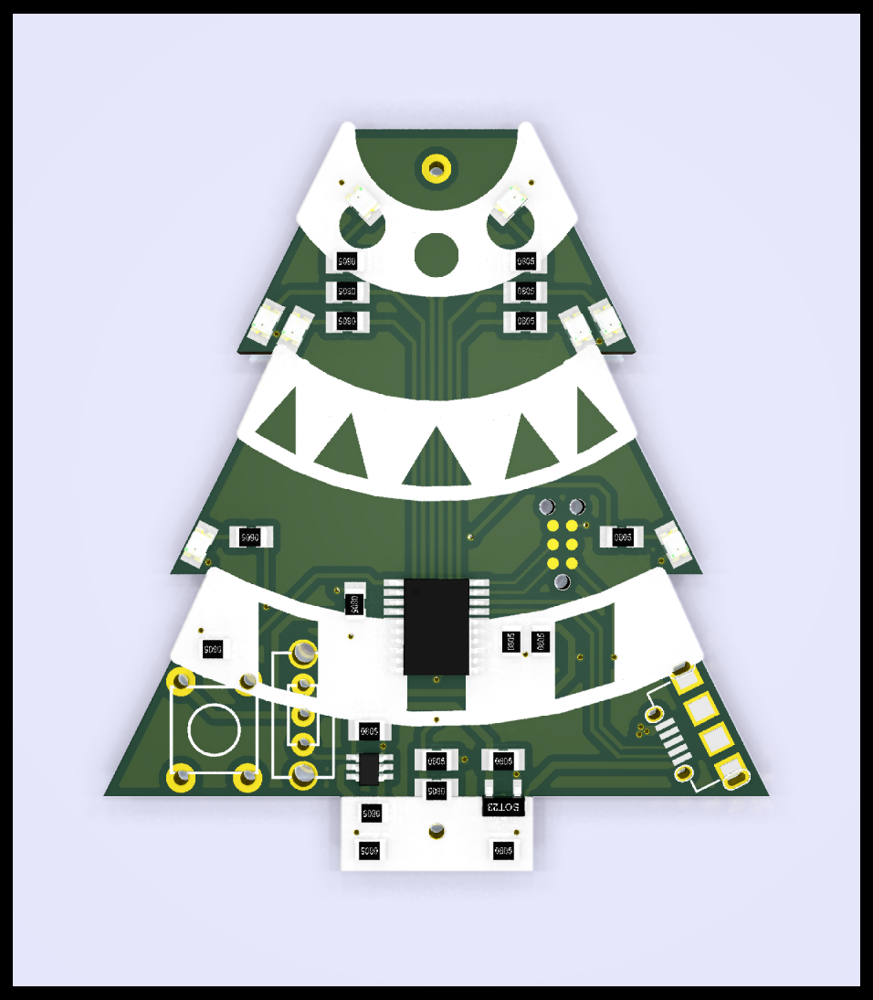

# Yuletronics: Electronics Club Project Michaelmas 2016

This repository contains the example Yuletronics project for Electronics Club. 
You can either use git to clone it, or simply download it 
[here](https://github.com/adamgreig/yuletronics/archive/master.zip).

You'll need KiCAD to open and edit the PCB: [download it 
here](http://kicad.org/). If you can easily get a nightly build, they have 
a few nice new features.

